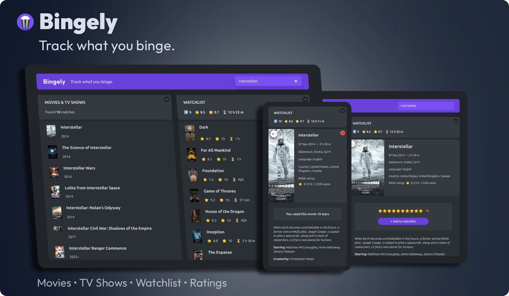
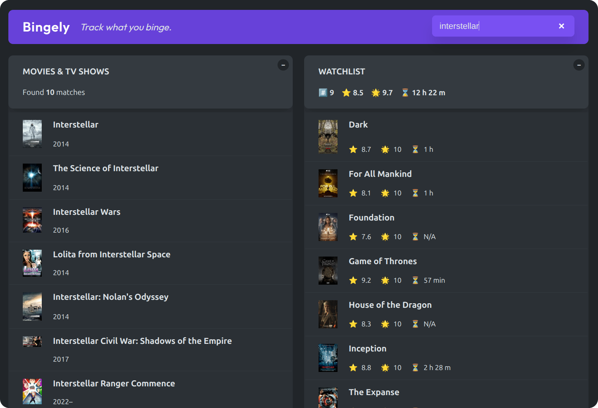
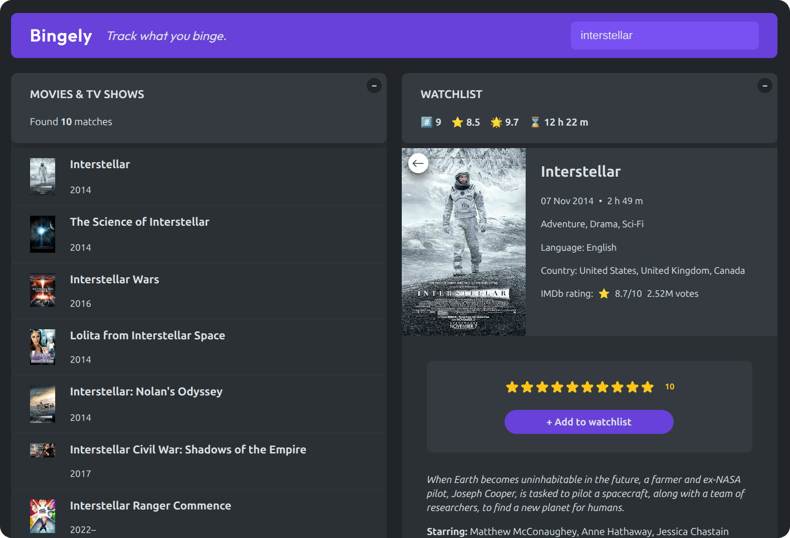
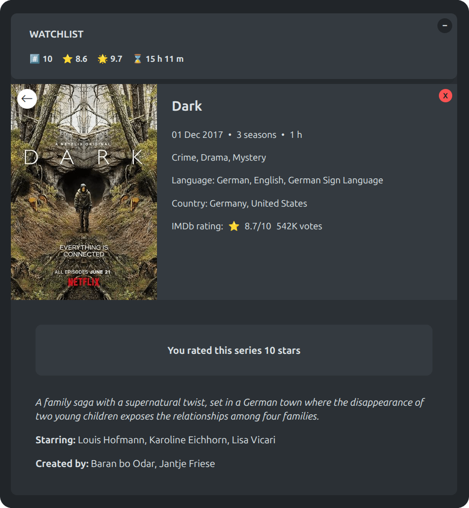
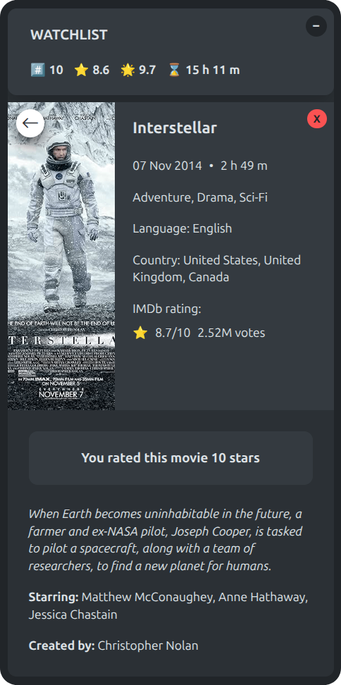

<div align="center">

#  Bingely

**_Track what you binge._**

A responsive web application for discovering movies and TV shows,  
rating titles, and managing a persistent watchlist.

Built with modern React patterns, custom hooks, and reusable UI components.  
Designed for performance, accessibility, and a smooth keyboard-first experience.



     

</div>

## ⫶☰ Table of Contents

- [Live Demo](#-live-demo)
- [Screenshots](#-screenshots)
- [Features](#-features)
- [Tech Stack](#-tech-stack)
- [Installation and Development](#-installation-and-development)
- [Project Structure](#-project-structure)
- [License](#-license)

## 🚀 Live Demo

[](https://bingely-list.vercel.app/)

## 📸 Screenshots

<details>
  <summary><strong>View Screenshots</strong></summary>

<br>

### Search Results & Watchlist Overview



### Rating



### Details View (Tablet)



### Details View (Mobile)



</details>

## ✨ Features

### 🔍 Search

- Fast, debounced search for movies and TV shows
- Dedicated results panel for browsing matches
- Detailed view with extended metadata

### ⭐ Rating

- Interactive star rating system

### 🎬 Watchlist

- Persistent watchlist with `localStorage`
- Watchlist statistics:
  - Total watched titles
  - Average IMDb rating
  - Average personal rating
  - Total estimated watch time

### ⌨ Keyboard-Friendly UI

- `/` focuses search
- `Esc` blurs search
- `Backspace` returns from details view
- Natural tab navigation

### 🤝 Accessibility

- Semantic HTML
- Custom focus states
- ARIA attributes
- Live region announcements

### 📱 Responsive Design

- Mobile-first interface
- Adaptive tablet and desktop layouts

## 🧰 Tech Stack

### ⚛️ Front End

- React 19
- Vite 8
- JavaScript (ES Modules)
- Modular vanilla CSS
- `localStorage` persistence
- ESLint + React Hooks rules
- Vercel deployment

### ⚡ API

- [OMDb API](https://www.omdbapi.com/) for movie and TV show data

### 🪝 Custom Hooks

- `useLocalStorageState` for persistent storage management
- `useMovieSearch` for data fetching with debounced search
- `useMovieDetails` for fetching additional information
- `useKey` for keydown event handling
- `useWindowWidth` for a dynamic search placeholder

## 🧩 Installation and Development

> [!IMPORTANT]  
> **Prerequisites:**
>
> - Node.js ≥ 18
> - npm ≥ 9

### 🖥️ Local Setup

1. Clone the repository and install dependencies:

```bash
git clone https://github.com/ana-vucic-dev/bingely.git
cd bingely
npm install
npm run dev
```

2. Create a `.env` file in the root directory:

```env
VITE_OMDB_API_KEY=your_api_key_here
```

### ⚙️ Production Build

```bash
npm run build
```

### 🔍 Build Preview

```bash
npm run preview
```

## 📂 Project Structure

```text
/
├── public/
│   ├── favicon/
│   └── screenshots/
├── src/
│   ├── components/     # UI components
│   ├── config/         # OMDb API configuration
│   ├── hooks/          # Custom hooks reused across UI logic
│   ├── styles/         # Modular CSS files split by feature/concern
│   ├── utils/          # Helper utilities (formatting, calculations)
│   ├── App.jsx         # App layout
│   └── main.jsx        # React entry point
├── index.html          # Vite entry file
├── .env
├── .gitignore
├── package.json
├── package-lock.json
├── vite.config.js
├── eslint.config.js
├── README.md
└── LICENSE
```

## 📄 License

This project is licensed under the [MIT License](LICENSE).
